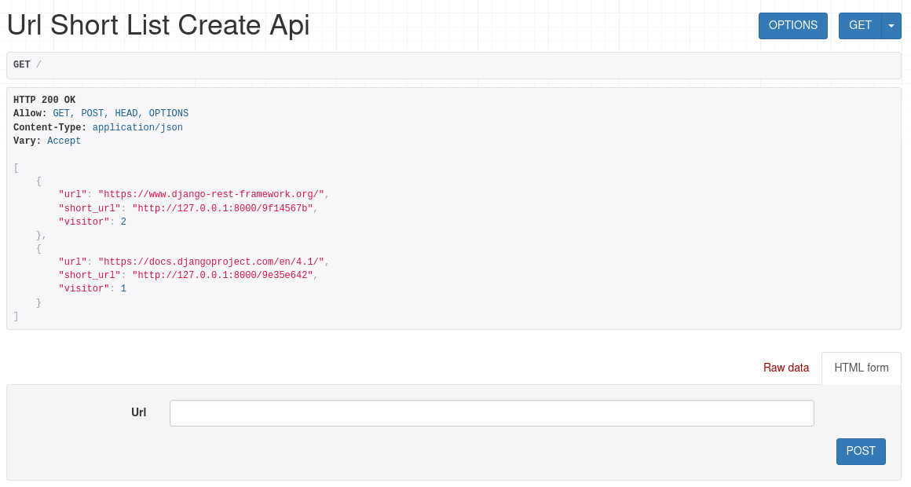

# ushort
url shortener by django



### Usage
I am using python "3.10.6" version 

first step clone my project
```
git clone https://github.com/sorooshm78/ushort/
```

and then install requirements  
```
pip install -r requirements.txt
```

This will create all the migrations file (database migrations) required to run this App.
```
python manage.py makemigrations
```

Now, to apply this migrations run the following command
```
python manage.py migrate
```

### Running the code 
Just go into the code directory and type 
```
python manage.py runserver
```
"ushort" app will start on 127.0.0.1:8000 (Local Address).
 
enjoy it!